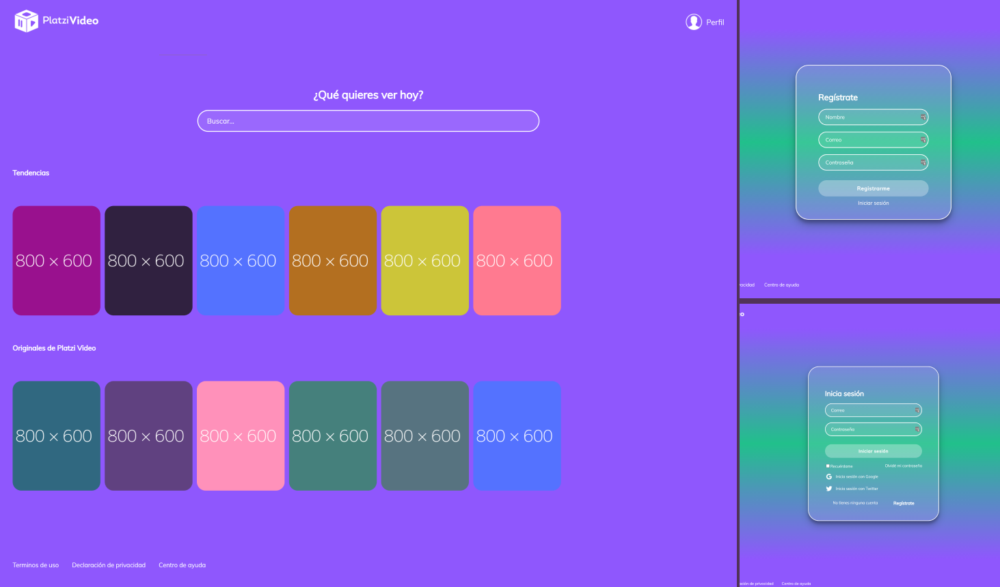

# PlatziVideo

Javascript study path project in Platzi to watch online videos. In this case, it is part of the frontend interface and will be followed by a backend to complete the project.

## Preview 🖼

## Demo 💻

If you want to see the demo, you can visit this link. **[Demo of the project](https://platzivideo-mxrold.netlify.app/)**

## Pre requirements 📋

To run this project or you want to modify something, you needed the next points
- A browser.
- A code editor as Visual Studio Code, Atom, Sublime Text, among others.
- Have Git and npm installed

## Installation - How to clone 🚀

To install and run this project you can to do with __git clone__
- With HTTPS
~~~
https://github.com/mxrold/platzi-video.git
~~~
- With SSH
~~~
git@github.com:mxrold/platzi-video.git
~~~

_Not sure how to clone a project? **[Check this](https://github.com/mxrold/how-to-clone-a-repository-in-github/blob/main/README.md)**_

## Building with 🛠️

- HTML
- CSS
- React
- Redux
- Webpack

### Notes
This is a project from **[Platzi's course on React Router y Redux](https://platzi.com/clases/react-router-redux/)**.
